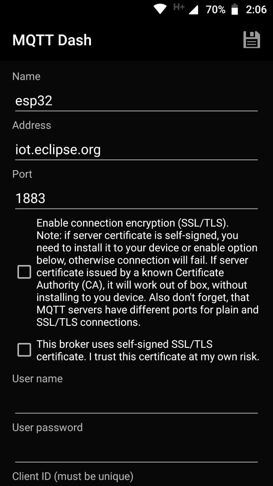
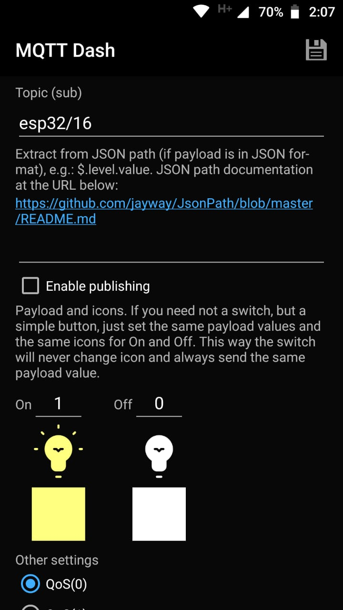

# esp32-mqtt-input
esp32 webserver/mqtt input reader

## Wifi

* ssid - wifi ssid
* password - wifi password

## PINOS

* PINO_MAX - max input pins
* PINO - io pins input

## MQTT

* mqtt_server - mqtt server name/ip
* mqtt_user - mqtt user
* mqtt_pass - mqtt password
* mqtt_topic - initial mqtt topic (Default esp32)

## MQTT Dash Config

Default configuration on MQTT Dash

